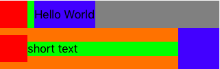
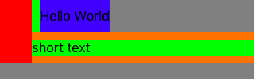
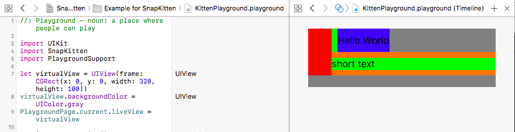

# SnapKitten

SnapKitten is a Linear Layout Solution Library based on SnapKit and Auto Layout.

[](http://cocoapods.org/pods/SnapKitten)
[](http://cocoapods.org/pods/SnapKitten)
[](http://cocoapods.org/pods/SnapKitten)

## Example

To run the example project, clone the repo, and run `pod install` from the Example directory first.

## Usage

```ruby
import UIKit
import SnapKitten
import PlaygroundSupport

let virtualView = UIView(frame: CGRect(x: 0, y: 0, width: 320, height: 480))
virtualView.backgroundColor = UIColor.gray
PlaygroundPage.current.liveView = virtualView

// ... some init UI Code

let simpleComponent = Kitten.horizontal().from()
.add(iv).size(40)
.add(lblA).itemOffset(10)
.build()
simpleComponent.backgroundColor = UIColor.green

let threeComponentExample = Kitten.horizontal()
.from().isAlignDirectionEnd(true).defaultAlignment(.center)
.add(iv2).size(40)
.add(lbl2).fillParent()
.add(iv3).size(60)
.build()
threeComponentExample.backgroundColor = UIColor.orange

Kitten.create(.vertical).from(virtualView)
    .add(simpleComponent).align(.start)
    .add(threeComponentExample)
    .build()
```
Result:


### So, What's Kitten (SnapKitten) Library?

Kitten is a constraint relation building library under SnapKitten and iOS Constraint system.
Kitten build the constraint relation between views and result in a Android LinearLayout-Like behaviour.

Kitten simplify the complex constraint system set-up and break it down to few simple linear relationship. 


### Kitten object creation
To create Kitten Object, it need to know the orientation in the beginning
```ruby
	//Kitten's method always return Protocol, but you can always force cast to Kitten itself
	Kitten.horizontal()
	Kitten.vertical()
```

### define Parent View
You may want to add views to a existing view. or Just create a new one.
Kitten support ScrollView, View, UIViewController and dyanmic create a new one.
for UIViewController, it default align topLayoutGuide  and bottomLayoutGuide
```ruby
	//all return KittenParentMethods protocol
	Kitten.vertical().from()
	Kitten.vertical().from(scrollView)
	Kitten.vertical().from(viewController)
	Kitten.vertical().from(view)
```

### setup Parent View
You can now setup basic setting after from() method. KittenParentMethods protocol provides some method for you layout basic setup.
```ruby
	//.center, .start, .end, .parent
	defaultAlignment(enum)//a perpendicular alignment of child views
	startPadding(int)//offset with first item and parent
	endPadding(int)//offset with last item and parent
	itemDefaultOffset(int) //offset between item
	itemDefaultSideStartPadding(int)//perpendicular offset, always top or left
	itemDefaultSideEndPadding(int) //perpendicualr offset, always bottom or right
	itemDefaultSidePadding(int)
	allPadding(int)//all four direction padding, except item-to-item
	isAlignDirectionEnd(bool) //determine if last child align parent's end. Like match_parent in LinearLayout
	weightMode(bool) // change to weightMode, child's size based on the weight related to parent, usually use with isAlignDirectionEnd(true)
```
### add you first child view
you can always add a view to Kitten or find existing view with KittenChild protocol.
```ruby
	add(UIView)//add a child to Kitten, following KittenChildMethods is updating this child view 
	with(UIView)//find existing child, and update it in following method call
	addChilds(UIView ...)
	addChilds([UIView])
```

### setup your child view
after add your child, you may need to provide some information about this view
```ruby
	itemOffset(int)//a offset to previous item, for first child, it will not be active
	sideStartPadding(int)//a perpendicular padding of item, left or top
	sideEndPadding(int)//right or bottom
	sidePadding(int)
	width(int)//set the width of view
	height(int)//set the height of view
	size(int)//set the size of view
	alignSideStart()//align the parent start, top / left
	alignSideEnd()//align parent end, bottom / right
	alignSideCenter()//align center of parent, depend on orientation
	alignSideParent()//child align parent's width / height
	fillParent()//a child try to fit the size to parent as possible
	importanceHigh()//the importance of child, higher importance, it will not be compress if other view is big to fillup the parent orientation
	importanceMedium()
	importanceLow()
	weight(float)//active in weightMode(true) only, it determine the weight of item, default is 1.
```

### Build the constraint after setup
You must build the constraint after adding all children into Kitten class
build() and rebuild() return the parent UIView which contain children
```ruby
build() //will not remove subview / its constraint relation
rebuild() // remove subviews before build()
```

### Advance Usage

#### Kitten Object as variable
Kitten methods always return "Protocol" but you can always force cast to Kitten object
```ruby
	let kitten : Kitten = Kitten.horizonta() as! Kitten
	let kitten : Kitten = Kitten.horizonta().from() as! Kitten
	let kitten : Kitten = Kitten.horizonta().from().add(lblA) as! Kitten
```

#### condition insert child
As kitten is a linear relationship, children do not have actual relation to specific item
Kitten provides a condition method to allow the control of child insertion
```ruby
	let threeComponentExample = Kitten.horizontal()
.from().isAlignDirectionEnd(true).defaultAlignment(.center)
.add(iv2).size(40)
.add(lbl2).fillParent()
.add(iv3).size(60).condition({ () -> Bool in
	// you can determine the condition by any variable in your class
    return false
})
.rebuild()
```


#### Test your code in iOS Playground
You can always visualize test your code in iOS Playground
To open visual playground, Click "View > Assistant Editor > Show Assisant Editor" in Xcode
```ruby
import UIKit
import SnapKitten
import PlaygroundSupport

let virtualView = UIView(frame: CGRect(x: 0, y: 0, width: 320, height: 100))
virtualView.backgroundColor = UIColor.gray
PlaygroundPage.current.liveView = virtualView

let iv = UIImageView()
iv.backgroundColor = UIColor.red
let lblA = UILabel()
lblA.text = "Hello World"
lblA.backgroundColor = UIColor.blue

let simpleComponent = Kitten.horizontal().from()
.add(iv).size(40)
.add(lblA).itemOffset(10)
.build()
simpleComponent.backgroundColor = UIColor.green

Kitten.create(.vertical).from(virtualView)
    .add(simpleComponent).align(.start)
    .build()
```


## Requirements
- iOS 8.0+

## Installation

SnapKitten is available through [CocoaPods](http://cocoapods.org). To install
it, simply add the following line to your Podfile:

```ruby
pod "SnapKitten"
```

## Author

Spring, development.spring@gmail.com

## License

SnapKitten is available under the MIT license. See the LICENSE file for more info.
